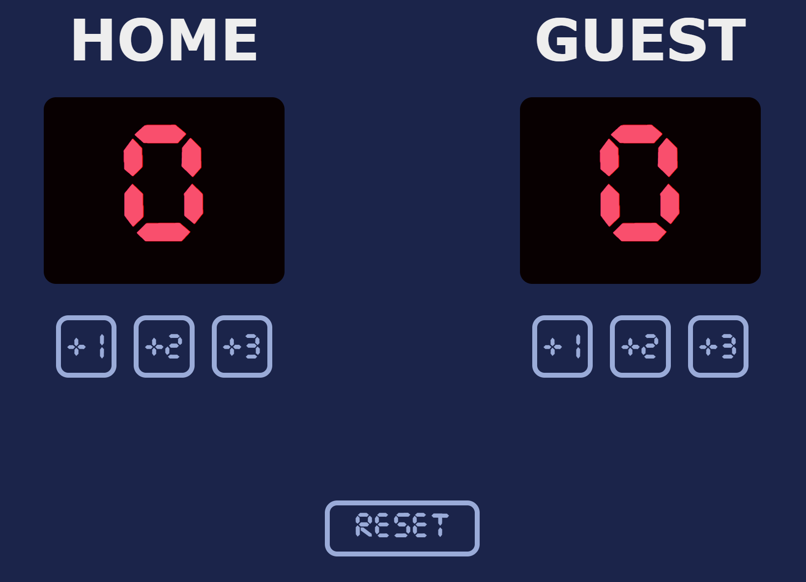

# Scoreboard App

A digital scoreboard interface built with HTML, CSS, and JavaScript. Features a clean, retro pixel-art design with separate HOME and GUEST score tracking, increment buttons (+1, +2, +3), and a reset functionality.

## Live Demo

🔗 **[View Live Demo](https://scoreboard-scrimba-ryo.netlify.app/)**

## Screenshot

The app displays a digital scoreboard interface with a clean, pixel-art style against a dark blue background. It features separate HOME and GUEST sections, each with score displays and increment buttons (+1, +2, +3), plus a reset button at the bottom.

## Features

- **Dual Score Tracking**: Separate score displays for HOME and GUEST teams
- **Flexible Scoring**: Three increment options (+1, +2, +3) for each team
- **Reset Functionality**: One-click reset to start over
- **Retro Design**: Pixel-art aesthetic with segmented digital number displays
- **Responsive Layout**: Clean, functional interface optimized for score tracking

---

## About Scrimba

At Scrimba our goal is to create the best possible coding school at the cost of a gym membership! 💜
If we succeed with this, it will give anyone who wants to become a software developer a realistic shot at succeeding, regardless of where they live and the size of their wallets 🎉
The Fullstack Developer Path aims to teach you everything you need to become a Junior Developer, or you could take a deep-dive with one of our advanced courses 🚀

- [Our courses](https://scrimba.com/courses)
- [The Frontend Career Path](https://scrimba.com/fullstack-path-c0fullstack)
- [Become a Scrimba Pro member](https://scrimba.com/pricing)

Happy Coding!